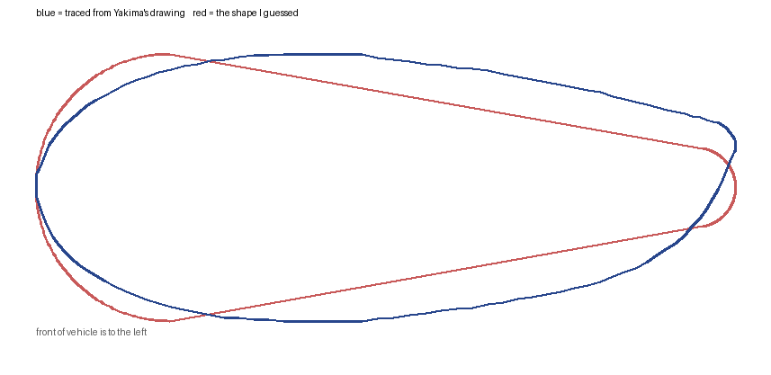

# 2x4 lumber rack for Yakima CoreBar crossbars

A printable TPU bracket that clamps two 2x4s across a pair of Yakima CoreBar
crossbars, turning them into a flat utility rack you can strap lumber,
ladders, pipe or a canoe to — and screw accessories into, because the top
surface is just wood.

Everything that carries load is hardware-store steel. The printed parts are
the interface between the bar's teardrop section and the flat face of the
board.

## How it works

Each place a 2x4 crosses a crossbar gets one bracket, so a rack takes four.

A 3/8" square-bend U-bolt passes under the crossbar, up either side of it,
through the printed **saddle**, and through two holes drilled in the 2x4.
Washers and lock nuts on top pull the whole stack together. The steel takes
all of the tension; nothing depends on the plastic holding a load.

The printed parts do four jobs that steel alone does badly:

- The **saddle** matches the bar's rounded teardrop crown to the flat
  underside of the board, so the board sits on a full-width bearing surface
  instead of rocking on a line of contact.
- The **pad** goes under the bar, inside the bend of the U-bolt, so bare
  steel never touches the bar's vinyl coating.
- Both spread the clamp load over several square inches of bar, which is what
  keeps a hollow steel bar from being dented by a 3/8" bolt.
- TPU damps vibration. Vibration is what backs nuts off on a roof.

## Bill of materials

### Hardware, per bracket (you need four)

| Qty | Part | Notes |
| --- | --- | --- |
| 1 | 3/8" **square-bend U-bolt** — see "Choosing a U-bolt" below | Leg length and thread length both matter, and the obvious 7" part does not work. |
| 2 | 3/8"-16 **nylon-insert lock nut**, zinc | Use these instead of the plain nuts in the U-bolt bag. Plain nuts on a roof rack will loosen. |
| 2 | 3/8" **flat washer** | Or one 3" square U-bolt plate, sold beside the U-bolts, which spreads the load better. |
| 1 | Printed **saddle** | |
| 1 | Printed **pad** | |

### For the rack

| Qty | Part | Notes |
| --- | --- | --- |
| 2 | 2x4, 8 ft | Kiln-dried SPF is fine and cheap. Cedar is lighter and will not rot. Pick the two straightest boards on the pile and sight down them. |
| — | Exterior paint or spar urethane | Seal all six faces, including the drilled holes, or the boards will swell and check. |
| 2+ | Cam or ratchet straps | The brackets hold the rack down. Straps hold the load down. These are not the same job. |

Roughly $30 of hardware and $10–16 of lumber.

### Tools

Drill with a 7/16" bit, 9/16" wrench or socket, hacksaw and file for trimming
the U-bolt legs, tape measure, and calipers if you have them.

## Printing

| U-bolt | Saddle | Pad | Gauge | Set of four |
| --- | --- | --- | --- | --- |
| 3" opening | 106 x 100 x 30 mm, ~85 g | 75 x 60 x 12 mm, ~29 g | ~8 g | ~460 g |
| 3-1/4" opening | 113 x 100 x 30 mm, ~98 g | 81 x 60 x 12 mm, ~32 g | ~10 g | ~530 g |

About half a spool, and a long weekend of printing. TPU does not print fast.

- **Material:** TPU 95A works. 98A or 60D is better here — stiffer, and it
  creeps less under sustained clamp load.
- **Layers:** 0.2 mm, 0.4 mm nozzle.
- **Walls:** 5 perimeters. The walls do most of the work in this part.
- **Infill:** 50% gyroid.
- **Top/bottom:** 6 layers.
- **Speed:** 20–25 mm/s. Direct drive strongly preferred.
- **Supports:** none needed.

**Orientation.** Stand the saddle on end, with the bar pocket running
vertically, and use a brim. In that orientation the whole part is a vertical
extrusion and nothing overhangs — the locating lips are ramped at 45° on
purpose. The two U-bolt holes end up horizontal and may sag slightly; open
them with the 7/16" bit if a leg will not pass.

If you would rather print flat, set `lip_h = 0` and lay the part top-face-down
on the bed. You lose the lips that hold the board square while you tighten,
but the print is trivial. The U-bolts locate the board either way.

## The bar section

The pocket is traced from Yakima's own cross-section drawing, not guessed.
The drawing labels the section **70.7 mm wide by 27.0 mm tall** — about
2.78" x 1.06", which settles the 2.75" versus 3" question in favour of the
smaller one.

The shape matters more than those two numbers. The first version of this
model built the section as a teardrop hulled from two circles, with the nose
a half-round as tall as the bar. That reaches full thickness within the first
quarter of the chord and then tapers away in a straight line. The real
section keeps thickening to **36% of the chord** and stays fat much further
back, so the bar fouled the roof of the pocket through its whole middle — it
simply would not go on, however much clearance was added.

The drawing's own pixels are 70.7 x 29.3 mm rather than 70.7 x 27.0, so it is
not quite to scale. The labelled figures are what Yakima states, so each axis
was scaled to them and the outline kept its shape.

`cad/corebar_profile.scad` holds the traced polygon. `bar_w` and `bar_h`
scale it if your bar measures differently; `bar_measured = false` falls back
to the old two-circle guess.

## Check the fit before you print four

The saddle drops straight down onto the bar and snaps over a small lip at the
leading edge. It does not wrap under the trailing edge:

A flat-bottomed skirt cannot do this on the real section, because the
trailing edge curls up to 3.7 mm *above* the centreline — the skirt would
close underneath it, and the saddle could then only go on by hooking that tip
under the bar and rotating the nose over. So the relief follows the bar's own
underside aft of its thickest point.

**Print a gauge first.** `stl/fit-gauges/` holds the 12 mm test slice at
three clearances, notched once, twice and three times so you can tell them
apart off the bed.

| Gauge | `bar_fit` | Clearance per side |
| --- | --- | --- |
| 1 notch | 0.6 | 0.30 mm |
| 2 notch | 1.0 | 0.50 mm |
| 3 notch | 1.6 | 0.80 mm |

Keep the loosest one that has no rock in it, set `bar_fit` to that number and
render the real parts. On Sean's bar the 1-notch gauge (0.3 mm per side) fit
best, and that is now the default.

## Choosing a U-bolt

Three numbers matter, and the third is the one that catches people.

1. **Inside opening** — must clear the bar with a little room for the skirt
   walls. 3-1/4" suits either published bar section. 3" only works if the bar
   really is 2.75" wide.
2. **Leg length** — at least **3-1/2"**, measured from the inside of the bend
   to the tip. Below that the nut has nothing to bite.
3. **Thread length** — the nut has to reach *down* to the top of the stack,
   which sits **3.1" above the inside of the bend**. So the thread has to have
   started by then:

   > thread length ≥ leg length − 3.1"

A 7" leg therefore needs nearly 4" of thread. Square U-bolts that long are
typically threaded only 1-1/2" from each tip, so the nut runs out of thread in
mid-air above the board and never touches it. Long legs are not the safe
choice here; they are the failure.

| Leg | Thread needed | Verdict |
| --- | --- | --- |
| 3-1/2" | 3/8" | tight but works |
| 4" | 7/8" | comfortable, the sweet spot |
| 4-1/2" | 1-3/8" | fine |
| 5" | 1-7/8" | check the listing carefully |
| 7" | 3-7/8" | will not work unless fully threaded |

Fully threaded legs sidestep the whole issue.

Set `ubolt_leg` and `ubolt_thread` in the `.scad` to whatever you are holding
and it will refuse to render, with the reason, if the nut cannot reach.

## If your U-bolt is a different width

Set `ubolt_inside` to the opening you have, in millimetres, and re-render.
Everything that depends on it follows: the hole pitch, the saddle's footprint,
and — the part that matters — the thickness of the skirt walls.

That last one is not cosmetic. A 3-1/4" U-bolt on a 2.75" bar leaves about
1/4" of free space on each side of the bar, so a saddle built for a 3" U-bolt
would let the bar slide almost half an inch fore-and-aft inside the bend
before anything stopped it. The model closes that gap by growing the skirt
walls out to meet the legs, and the leg holes, which are cut full depth,
scallop a cradle into the outside of each wall so the leg is held against the
bar rather than floating beside it.

Leg length is not sensitive. The stack — pad, bar, saddle, 2x4, washer and nut
— comes to about 3-1/2", so 7" legs leave plenty over on any of these.

## Where the numbers came from

- CoreBar section, 70.7 x 27.0 mm, traced from the drawing in
  [Yakima's support article on CoreBar dimensions](https://yakimasupport.zendesk.com/hc/en-us/articles/236010788-CoreBar-Bar-Dimensions).
  The retailer listings say 2.75" x 1.10", which is close on width and 1 mm
  out on height.
- U-bolt, 3/8" x 3" opening x 7" legs, A307 steel, nuts included —
  [Everbilt 810226 at The Home Depot](https://www.homedepot.com/p/Everbilt-3-8-in-x-3-in-x-7-in-Zinc-Plated-Square-U-Bolt-810226/204775849).
- 2x4 actual dimensions, 1.5" x 3.5" — standard dressed lumber.
