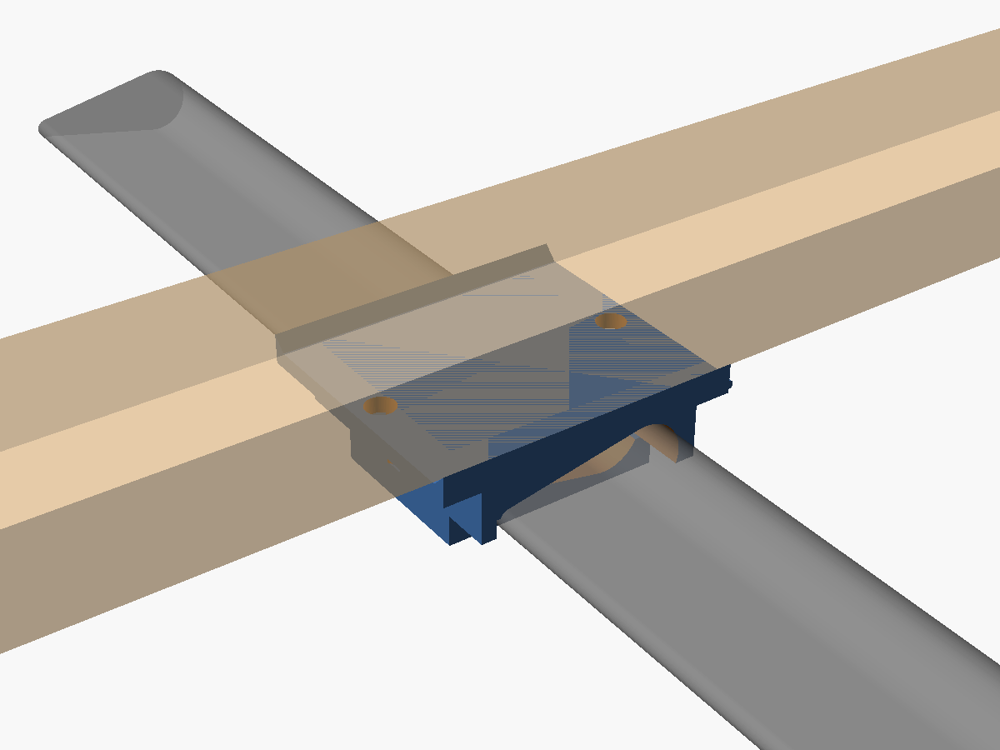
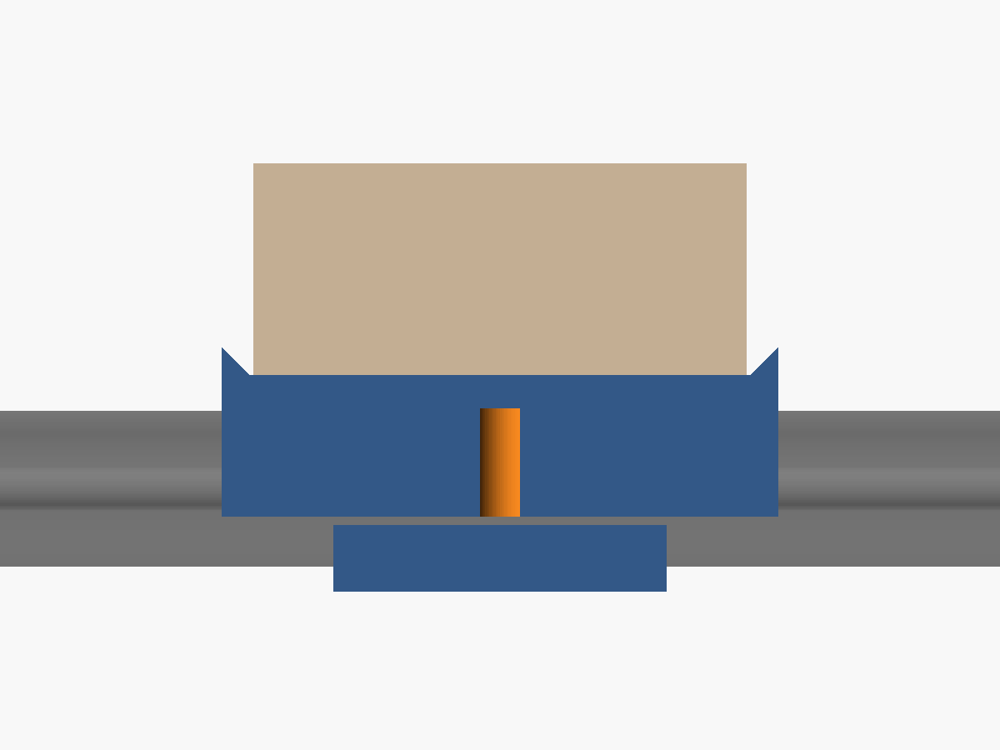
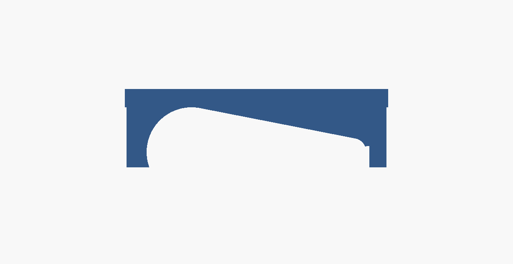

# 2x4 lumber rack for Yakima CoreBar crossbars

A printable TPU bracket that clamps two 2x4s across a pair of Yakima CoreBar
crossbars, turning them into a flat utility rack you can strap lumber,
ladders, pipe or a canoe to — and screw accessories into, because the top
surface is just wood.

Everything that carries load is hardware-store steel. The printed parts are
the interface between the bar's teardrop section and the flat face of the
board.



## How it works

Each place a 2x4 crosses a crossbar gets one bracket, so a rack takes four.

A 3/8" square-bend U-bolt passes under the crossbar, up either side of it,
through the printed **saddle**, and through two holes drilled in the 2x4.
Washers and lock nuts on top pull the whole stack together. The steel takes
all of the tension; nothing depends on the plastic holding a load.

The printed parts do four jobs that steel alone does badly:

- The **saddle** matches the bar's rounded teardrop crown to the flat
  underside of the board, so the board sits on a full-width bearing surface
  instead of rocking on a line of contact.
- The **pad** goes under the bar, inside the bend of the U-bolt, so bare
  steel never touches the bar's vinyl coating.
- Both spread the clamp load over several square inches of bar, which is what
  keeps a hollow steel bar from being dented by a 3/8" bolt.
- TPU damps vibration. Vibration is what backs nuts off on a roof.



## Bill of materials

### Hardware, per bracket (you need four)

| Qty | Part | Notes |
| --- | --- | --- |
| 1 | 3/8" **square-bend U-bolt**, 3" or 3-1/4" inside opening, 7" legs | Square bend matters: the flat bottom matches the bar. Both openings work — print the STLs from the matching folder. Everbilt 810226 is the 3" one, about $7.25. |
| 2 | 3/8"-16 **nylon-insert lock nut**, zinc | Use these instead of the plain nuts in the U-bolt bag. Plain nuts on a roof rack will loosen. |
| 2 | 3/8" **flat washer** | Or one 3" square U-bolt plate, sold beside the U-bolts, which spreads the load better. |
| 1 | Printed **saddle** | |
| 1 | Printed **pad** | |

### For the rack

| Qty | Part | Notes |
| --- | --- | --- |
| 2 | 2x4, 8 ft | Kiln-dried SPF is fine and cheap. Cedar is lighter and will not rot. Pick the two straightest boards on the pile and sight down them. |
| — | Exterior paint or spar urethane | Seal all six faces, including the drilled holes, or the boards will swell and check. |
| 2+ | Cam or ratchet straps | The brackets hold the rack down. Straps hold the load down. These are not the same job. |

Roughly $30 of hardware and $10–16 of lumber.

### Tools

Drill with a 7/16" bit, 9/16" wrench or socket, hacksaw and file for trimming
the U-bolt legs, tape measure, and calipers if you have them.

## Printing

| U-bolt | Saddle | Pad | Gauge | Set of four |
| --- | --- | --- | --- | --- |
| 3" opening | 106 x 100 x 30 mm, ~85 g | 75 x 60 x 12 mm, ~29 g | ~8 g | ~460 g |
| 3-1/4" opening | 113 x 100 x 30 mm, ~98 g | 81 x 60 x 12 mm, ~32 g | ~10 g | ~530 g |

About half a spool, and a long weekend of printing. TPU does not print fast.

- **Material:** TPU 95A works. 98A or 60D is better here — stiffer, and it
  creeps less under sustained clamp load.
- **Layers:** 0.2 mm, 0.4 mm nozzle.
- **Walls:** 5 perimeters. The walls do most of the work in this part.
- **Infill:** 50% gyroid.
- **Top/bottom:** 6 layers.
- **Speed:** 20–25 mm/s. Direct drive strongly preferred.
- **Supports:** none needed.

**Orientation.** Stand the saddle on end, with the bar pocket running
vertically, and use a brim. In that orientation the whole part is a vertical
extrusion and nothing overhangs — the locating lips are ramped at 45° on
purpose. The two U-bolt holes end up horizontal and may sag slightly; open
them with the 7/16" bit if a leg will not pass.

If you would rather print flat, set `lip_h = 0` and lay the part top-face-down
on the bed. You lose the lips that hold the board square while you tighten,
but the print is trivial. The U-bolts locate the board either way.

## Check the fit before you print four

Yakima publishes the CoreBar section as 2.75" wide by 1.10" tall in their
JetFlow teardrop shape, and that is what the model defaults to. Those numbers
came from Yakima's own listing, not from a bar on a bench, so treat the first
gauge print as the real measurement.

The saddle drops straight down onto the bar and snaps over the leading edge.
It does not wrap under the thin trailing edge — the skirt is relieved away on
that side, rising from a full wrap at the nose to clear of the bar by the
tail:



That matters for fit as much as for assembly. Wrapping the trailing edge left
a sliver of TPU under the bar thinner than one perimeter and meant the saddle
could only go on by hooking that tip under the bar and rotating the nose over,
which reads as "it doesn't fit" even when the pocket itself is the right size.

**Print the fit gauges first.** `stl/fit-gauges/` holds the same 12 mm slice
at four clearances, from 0.30 mm per side to 0.90 mm. Each takes a few
minutes. Push them on and keep the loosest one that still has no play when you
try to rock it — then set `bar_fit` in the `.scad` to that file's number and
render the real parts. The default is 1.0 mm, which is 0.5 mm per side.

If none of them sit right, the section itself is wrong rather than the
clearance. Measure the bar with calipers across its widest point and at its
tallest, and set `bar_w` and `bar_h` to match.

## Assembly

1. **Seal the boards.** Paint or varnish them and let them dry before
   drilling. It is much easier now than later.
2. **Lay the boards on the bars** where you want them, parallel, and square
   them to the vehicle. Somewhere around 30–40" apart suits most loads; the
   limit is your crossbar length and your mirrors.
3. **Mark the holes using the saddle as a drill jig.** Set a saddle on the bar
   under the board, mark through its two holes, and you get the right pitch
   automatically, centred across the board's 3.5" width — 3-3/8" with a 3"
   U-bolt, 3-5/8" with a 3-1/4" one.
4. **Drill 7/16"** straight through the 1.5" thickness at all eight
   locations. Seal the fresh holes.
5. **Assemble each joint** bottom-up: U-bolt around the bar, pad seated under
   the bar inside the bend, saddle over the bar with its bead facing forward,
   board on top, then washers or plate, then lock nuts.
6. **Tighten evenly**, alternating sides. Stop when the TPU has visibly
   compressed and the assembly will not twist by hand — roughly 10–12 ft-lb.
   **Do not lean on it.** The limit here is the crossbar, not the bolt: a
   CoreBar is hollow steel and a 3/8" U-bolt can crush it.
7. **Trim the legs.** With 7" legs and a 3.5" stack, about 3.5" of thread will
   stick up. Mark, hacksaw, file the burr, and cap them with acorn nuts.
   Exposed threads on a roof catch straps, cargo and hands.
8. **Re-tighten after the first 30 miles**, then before every trip. TPU takes
   a set under load; the first re-torque is not optional.

## Limits and safety

This is a homemade bracket. It has not been load tested or certified, and
nothing here is a manufacturer's specification.

- **The rack's capacity is whatever your vehicle's roof is rated for, or
  whatever Yakima rates your towers and bars for, whichever is lower.** Check
  both. Yakima rack systems are commonly rated around 165 lb dynamic, but it
  depends on your towers and your vehicle's fitting — look up yours.
- The rack itself eats into that. Two 8-ft SPF 2x4s plus hardware is roughly
  25 lb before you load anything.
- Strap every load directly to the 2x4s, front and back. Do not rely on
  friction.
- Anything overhanging the vehicle needs a red flag, and lights at night in
  many states. Check your state's rules.
- Check your garage, hatch and tailgate clearance before you drive anywhere.
- Inspect all eight nuts before every trip.

## Files

```
cad/corebar_2x4_saddle.scad   parametric source; every fit dimension is a named variable
stl/ubolt-3in/                for a 3" inside opening
stl/ubolt-3.25in/             for a 3-1/4" inside opening
    saddle.stl                the top part, print 4
    pad.stl                   the under-bar pad, print 4
    gauge.stl                 pocket test slice
stl/fit-gauges/               the same slice at four clearances; print these first
docs/img/                     renders
```

Re-render after editing the source, setting `ubolt_inside` in mm:

```sh
for p in saddle pad gauge; do
  openscad -o "stl/ubolt-3.25in/$p.stl" -D "part=\"$p\"" -D ubolt_inside=82.55 \
    cad/corebar_2x4_saddle.scad
done
```

`part="assembly"` renders the saddle, pad, bar and board together for checking
fit on screen.

## If your U-bolt is a different width

Set `ubolt_inside` to the opening you have, in millimetres, and re-render.
Everything that depends on it follows: the hole pitch, the saddle's footprint,
and — the part that matters — the thickness of the skirt walls.

That last one is not cosmetic. A 3-1/4" U-bolt on a 2.75" bar leaves about
1/4" of free space on each side of the bar, so a saddle built for a 3" U-bolt
would let the bar slide almost half an inch fore-and-aft inside the bend
before anything stopped it. The model closes that gap by growing the skirt
walls out to meet the legs, and the leg holes, which are cut full depth,
scallop a cradle into the outside of each wall so the leg is held against the
bar rather than floating beside it.

Leg length is not sensitive. The stack — pad, bar, saddle, 2x4, washer and nut
— comes to about 3-1/2", so 7" legs leave plenty over on any of these.

## Where the numbers came from

- CoreBar section, 2.75" x 1.10", JetFlow teardrop —
  [Yakima's CoreBar listing](https://yakima.com/products/corebar) and
  [etrailer's spec sheet](https://www.etrailer.com/Roof-Rack/Yakima/Y00422.html).
- U-bolt, 3/8" x 3" opening x 7" legs, A307 steel, nuts included —
  [Everbilt 810226 at The Home Depot](https://www.homedepot.com/p/Everbilt-3-8-in-x-3-in-x-7-in-Zinc-Plated-Square-U-Bolt-810226/204775849).
- 2x4 actual dimensions, 1.5" x 3.5" — standard dressed lumber.
