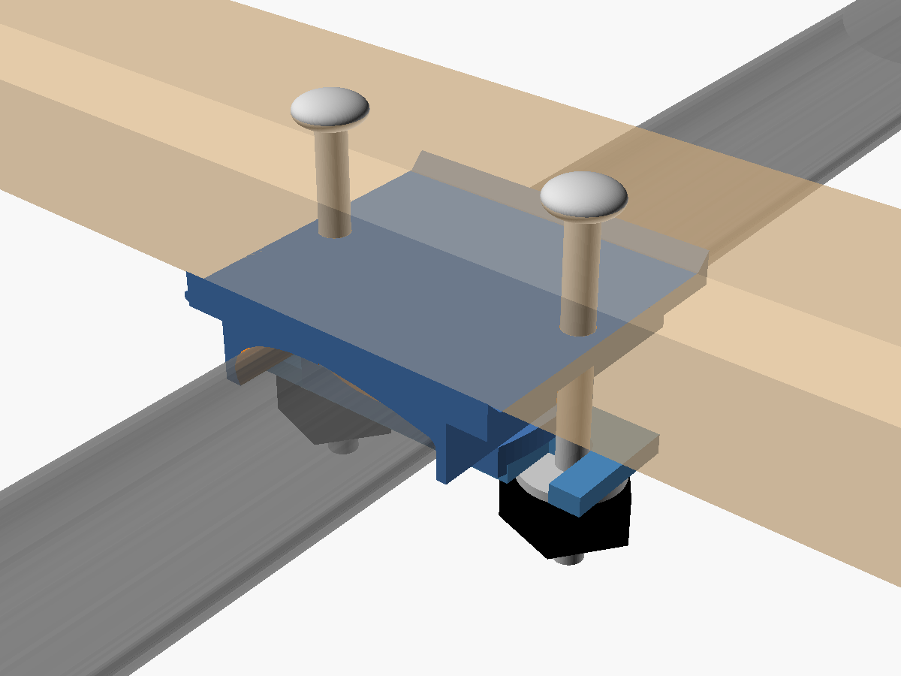
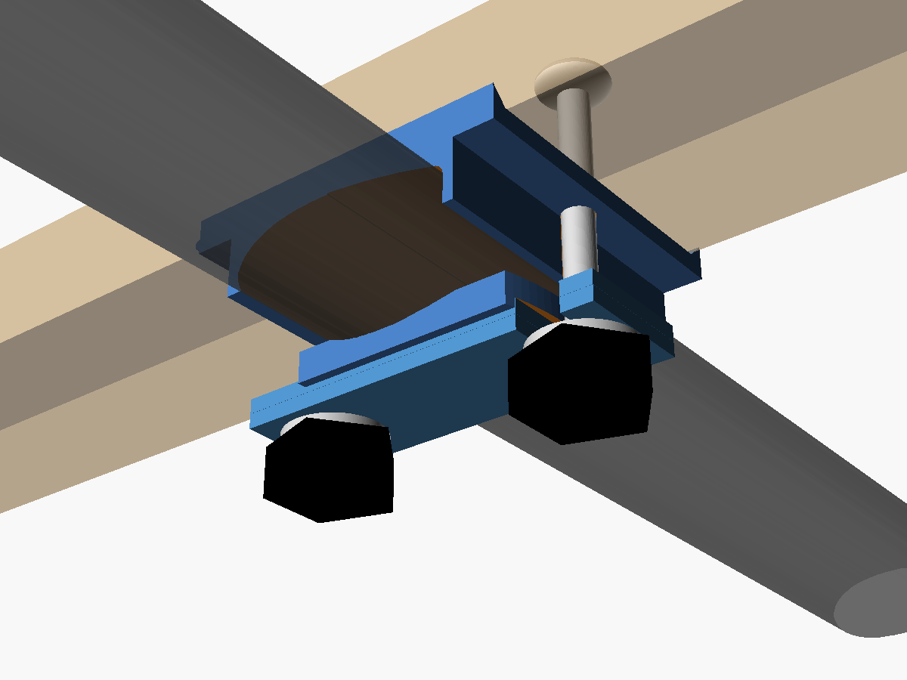
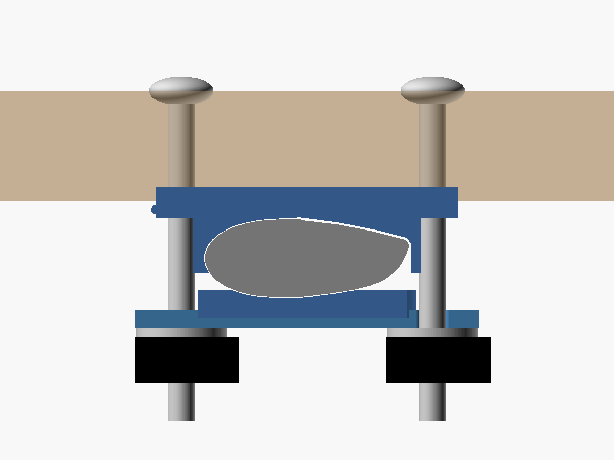
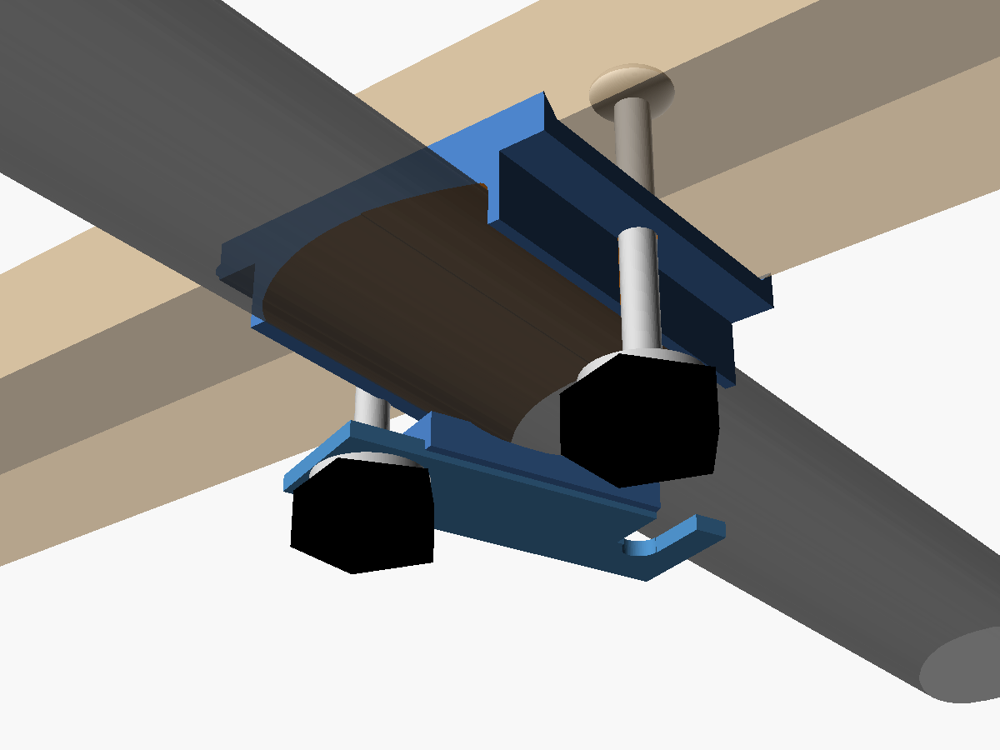
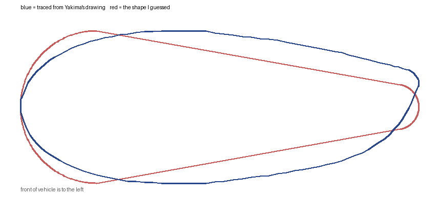
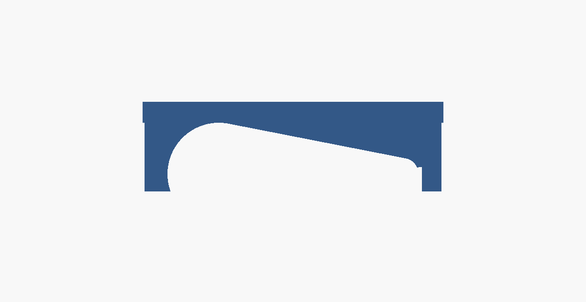

# 2x4 lumber rack for Yakima CoreBar crossbars

A printable TPU bracket that clamps two 2x4s across a pair of Yakima CoreBar
crossbars, turning them into a flat utility rack you can strap lumber,
ladders, pipe or a canoe to — and screw accessories into, because the top
surface is just wood.

It comes off without tools and without anything coming loose: back off two
knobs a few turns, swing a plate out from under the bar, lift the board.

Everything that carries load is hardware-store steel. The printed parts are
the interface between the bar's teardrop section and the flat face of the
board.

## How it works

Each place a 2x4 crosses a crossbar gets one bracket, so a rack takes four.

Two 3/8" **carriage bolts** live in the 2x4 permanently, heads on top, their
square necks biting into the wood so they can never turn or drop out. They
pass down through the printed **saddle**, past the front and back of the
bar, and through a short **steel plate** under it. Knobs on the bolts pull
the plate up against the bar. The steel takes all of the tension; nothing
depends on the plastic holding a load.

The plate has a round hole at one end and an **open-sided notch** at the
other. That is the whole trick.

The printed parts do four jobs that steel alone does badly:

- The **saddle** matches the bar's rounded teardrop crown to the flat
  underside of the board, so the board sits on a full-width bearing surface
  instead of rocking on a line of contact.
- The **pad** is bonded to the top of the plate, so bare steel never touches
  the bar's vinyl coating.
- Both spread the clamp load over several square inches of bar, which is what
  keeps a hollow steel bar from being dented by the clamp.
- TPU damps vibration. Vibration is what backs knobs off on a roof.

## Taking it off and putting it back

**Off:** back each knob off **3 turns**. The plate and pad drop about 4 mm,
clear of the underside of the bar. Swing the plate out around the pivot bolt
— the notched end slides off its bolt sideways — and lift the board. Every
part stays on the board: bolts, saddle, plate, pad, washers, knobs.

**On:** set the board on the bars with the saddles over them (the bead on the
saddle faces forward), swing each plate back under its bar until the notch
picks up its bolt, and snug the knobs down by hand.

If the rack comes off as one piece often, screw two slats across between the
2x4s just outside the brackets. Then it lifts off as a single ladder frame,
and it goes back on already square.

The notch is not simply a slot the width of the bolt. Every point on the
plate swings on a circle round the pivot, so as the plate turns, the bolt
sweeps across the notch at a slight angle. The model widens the notch and
shifts it toward the pivot just enough to clear that sweep — it is still two
straight hacksaw cuts — and trims the pad's far corners to a circle for the
same reason. Checked by simulation over the full 90° swing: the closest
anything comes to the bolt is 0.8 mm.

## Bill of materials

### Hardware, per bracket (you need four)

| Qty | Part | Notes |
| --- | --- | --- |
| 2 | 3/8"-16 x 4-1/2" **carriage bolt**, zinc or stainless | 4" also works; see "Choosing bolts" below. |
| 2 | 3/8"-16 **through-hole hand knob** (five-star or T) | Through-hole, not blind, so the bolt can pass. A steel-hub knob takes more torque than an all-plastic one. |
| 2 | 3/8" x 1-1/4" **fender washer** | Wide enough to bridge the notch in the plate. |
| — | 1/4" x 1-1/2" **steel flat bar**, 4-11/16" per bracket | One 36" stick makes all four plates with room to spare. |
| 1 | Printed **saddle** | |
| 1 | Printed **pad** | |
| — | Flexible adhesive | Shoe Goo, E6000 or contact cement, to bond the pad to the plate. |

**Knobs and vibration.** A hand-tight knob will not hold as much preload as a
wrenched lock nut, so check the knobs before every trip and after the first
twenty miles with a load. If one keeps working loose, put a split lock washer
under that knob, or use a steel wing nut instead: still no tools, and you can
lean on it harder. Knobs also make the rack easy to steal. One keyed or
security nut per board fixes that.

### For the rack

| Qty | Part | Notes |
| --- | --- | --- |
| 2 | 2x4, 8 ft | Kiln-dried SPF is fine and cheap. Cedar is lighter and will not rot. Pick the two straightest boards on the pile and sight down them. |
| — | Exterior paint or spar urethane | Seal all six faces, including the drilled holes, or the boards will swell and check. |
| 2+ | Cam or ratchet straps | The brackets hold the rack down. Straps hold the load down. These are not the same job. |

### Tools

Drill with 3/8" and 7/16" bits, hacksaw, file, hammer, tape measure, and
calipers if you have them. A drill press helps with the plates.

## Making the plates

Render `part = "plate_template"`, export it as SVG, print it at **100%
scale**, and check the 50 mm bar on it with a ruler. A copy is in
`stl/plate_template.svg` for the default settings.

1. Cut 4-11/16" (119 mm) of flat bar per plate and square the ends.
2. Glue the template on, centre-punch both crosshairs, and drill **7/16"**.
3. At the notched end, hacksaw the two straight lines from the hole out to
   the edge and snap or file out the waste. The notch is about 9/16"
   (14 mm) wide, and is deliberately off-centre on the hole, toward the
   pivot.
4. Break every edge with a file, then paint or zinc-spray the plate.
5. Bond the printed pad onto the plate, in its channel, curved face up.

## Printing

| Part | Size | Weight |
| --- | --- | --- |
| Saddle | 106 x 100 x 30 mm | ~87 g |
| Pad | 76 x 45 x 10 mm | ~18 g |
| Gauge | 80 x 12 x 25 mm | ~8 g |

About 420 g for a set of four, and a long weekend of printing. TPU does not
print fast.

- **Material:** TPU 95A works. 98A or 60D is better here — stiffer, and it
  creeps less under sustained clamp load.
- **Layers:** 0.2 mm, 0.4 mm nozzle.
- **Walls:** 5 perimeters. The walls do most of the work in this part.
- **Infill:** 50% gyroid.
- **Top/bottom:** 6 layers.
- **Speed:** 20–25 mm/s. Direct drive strongly preferred.
- **Supports:** none needed.

**Orientation.** Stand the saddle on end, with the bar pocket running
vertically, and use a brim. In that orientation the whole part is a vertical
extrusion and nothing overhangs — the locating lips are ramped at 45° on
purpose. The bolt holes are sized to grip the bolt shank lightly, so the
saddle stays on the board when it comes off the car. They print horizontal
and may sag; if a bolt will not go through, open the hole with a 3/8" bit.

Stand the pad on end too, so the cradle is a vertical extrusion. Printed
flat, the channel for the plate would be a 38 mm bridge.

If you would rather print the saddle flat, set `lip_h = 0` and lay it
top-face-down on the bed. You lose the lips that hold the board square while
you tighten, but the print is trivial. The bolts locate the board either way.

## Assembly

1. Drill the 2x4 **3/8"** straight through at the hole pitch the model
   echoes — **86.8 mm (just under 3-7/16")** for the default bar, centred on where the
   board crosses the bar. A drill guide or drill press keeps the holes
   square; a wandering hole makes the plate bind.
2. Tap each carriage bolt down through from the top until the square neck
   is seated in the wood.
3. Push the saddle up the bolts until it sits against the board, bead facing
   forward.
4. Put a fender washer and a knob on each bolt, a few threads on, and mount
   the board as in "Taking it off and putting it back".

## The bar section

The pocket is traced from Yakima's own cross-section drawing, not guessed.
The drawing labels the section **70.7 mm wide by 27.0 mm tall** — about
2.78" x 1.06", which settles the 2.75" versus 3" question in favour of the
smaller one.

The shape matters more than those two numbers. The first version of this
model built the section as a teardrop hulled from two circles, with the nose
a half-round as tall as the bar. That reaches full thickness within the first
quarter of the chord and then tapers away in a straight line. The real
section keeps thickening to **36% of the chord** and stays fat much further
back, so the bar fouled the roof of the pocket through its whole middle — it
simply would not go on, however much clearance was added.

The drawing's own pixels are 70.7 x 29.3 mm rather than 70.7 x 27.0, so it is
not quite to scale. The labelled figures are what Yakima states, so each axis
was scaled to them and the outline kept its shape.

`cad/corebar_profile.scad` holds the traced polygon. `bar_w` and `bar_h`
scale it if your bar measures differently; `bar_measured = false` falls back
to the old two-circle guess.

## Check the fit before you print four

The saddle drops straight down onto the bar and snaps over a small lip at the
leading edge. It does not wrap under the trailing edge:

A flat-bottomed skirt cannot do this on the real section, because the
trailing edge curls up to 3.7 mm *above* the centreline — the skirt would
close underneath it, and the saddle could then only go on by hooking that tip
under the bar and rotating the nose over. So the relief follows the bar's own
underside aft of its thickest point.

**Print a gauge first.** `stl/fit-gauges/` holds the 12 mm test slice at
three clearances, notched once, twice and three times so you can tell them
apart off the bed.

| Gauge | `bar_fit` | Clearance per side |
| --- | --- | --- |
| 1 notch | 0.6 | 0.30 mm |
| 2 notch | 1.0 | 0.50 mm |
| 3 notch | 1.6 | 0.80 mm |

Keep the loosest one that has no rock in it, set `bar_fit` to that number and
render the real parts. On Sean's bar the 1-notch gauge (0.3 mm per side) fit
best, and that is now the default.

## Choosing bolts

Two numbers matter.

1. **Length** — the knob sits **3.35" below the head**, and it has to keep
   enough thread to hold when it is backed off 3 turns to swing the plate.
   That makes **4"** the shortest bolt that works, with little to spare.
   **4-1/2"** is the default and leaves room for paint, a swollen board or
   a thicker washer. Longer only adds steel hanging under the bar: at 4-1/2"
   the tip is 1.7" below the bar, so check it clears the roof, especially
   near the edges where the roof curves down.
2. **Thread length** — the knob has to be able to run up to the plate, so
   the thread must start less than 3.35" below the head. Carriage bolts in
   these lengths are usually threaded 1-1/2" or more, which is plenty.

Set `bolt_len` and `bolt_thread` in the `.scad` to whatever you are holding.
It echoes the numbers above for your settings, and refuses to render, with
the reason, if the knob cannot reach the plate or would fall off before the
plate swings clear.

## If your bar is a different width

Set `bar_w` (and `bar_h`) to what you measure and re-render. Nothing depends
on a stock part size any more: the bolt pitch follows the bar, with
`bolt_gap` (3 mm) of free space between the pocket and each bolt, and the
plate, notch, skirt walls and pad all follow the pitch. Re-print the plate
template and re-drill to the new pitch the model echoes.

The skirt walls run out to the bolts, and the bolt holes, cut full depth,
scallop a cradle into the outside of each wall, so the bar is held between
the bolts rather than free to slide fore-and-aft between them.

## Configuration

`pivot` picks which bolt the plate swings on, front or rear, and
`swing_side` which way the free end swings. Set it to swing toward the side
you stand on. `pad_wrap` sets how deep the pad's cradle is; deeper grips
the bar better but means more turns to release. `part = "open"` renders the
assembly with the plate swung out, to check a change.

## Where the numbers came from

- CoreBar section, 70.7 x 27.0 mm, traced from the drawing in
  [Yakima's support article on CoreBar dimensions](https://yakimasupport.zendesk.com/hc/en-us/articles/236010788-CoreBar-Bar-Dimensions).
  The retailer listings say 2.75" x 1.10", which is close on width and 1 mm
  out on height.
- 2x4 actual dimensions, 1.5" x 3.5" — standard dressed lumber.
- 3/8"-16 carriage bolts, fender washers, hand knobs and 1/4" x 1-1/2" flat
  bar — standard hardware-store stock.
